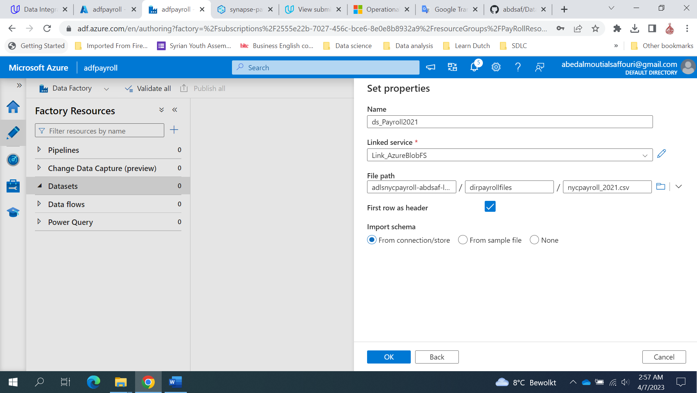
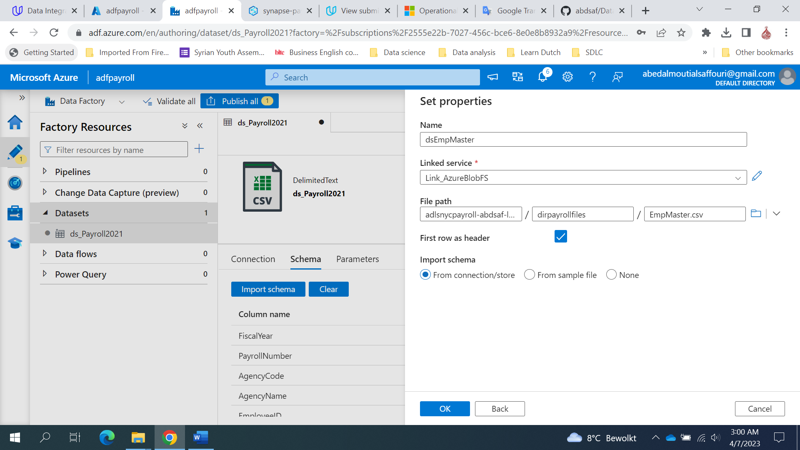
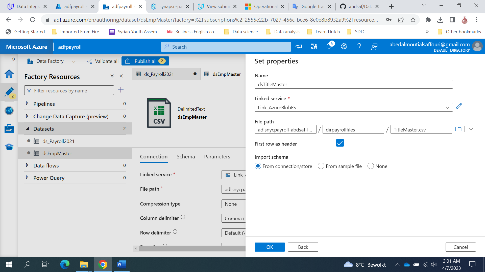
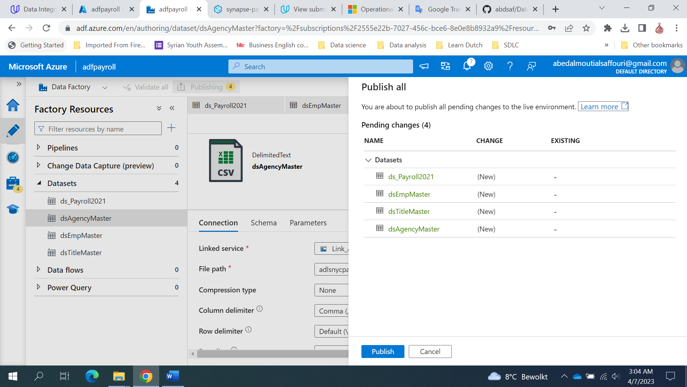
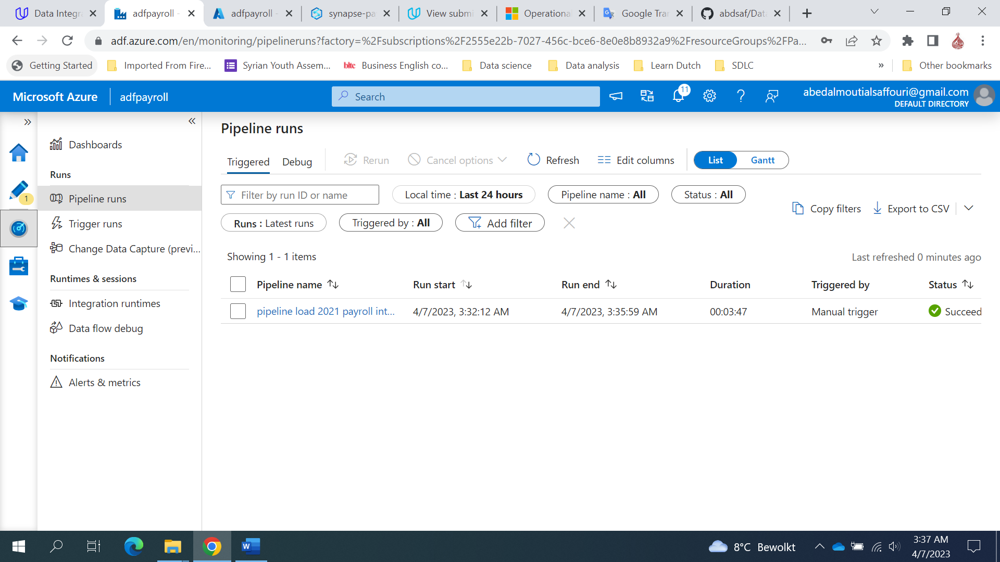
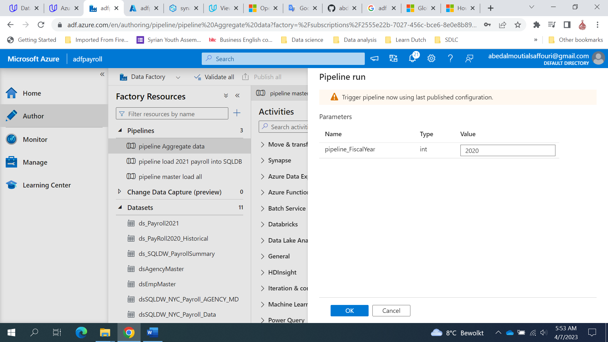
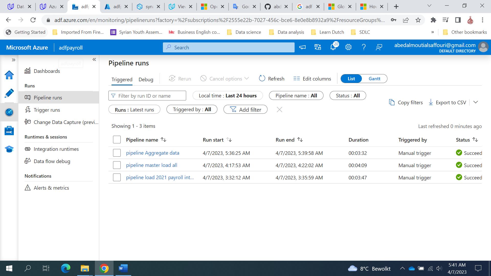
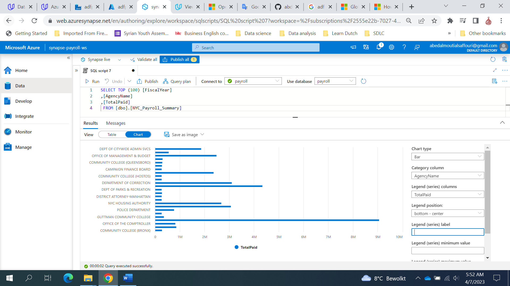

## Project: Data Integration Pipelines for NYC Payroll Data Analytics
The City of New York would like to develop a Data Analytics platform on Azure Synapse Analytics to accomplish two primary objectives:

Analyze how the City's financial resources are allocated and how much of the City's budget is being devoted to overtime.
Make the data available to the interested public to show how the City’s budget is being spent on salary and overtime pay for all municipal employees.
You have been hired as a Data Engineer to create high-quality data pipelines that are dynamic, can be automated, and monitored for efficient operation. The project team also includes the city’s quality assurance experts who will test the pipelines to find any errors and improve overall data quality.

The source data resides in Azure Data Lake and needs to be processed in a NYC data warehouse in Azure Synapse Analytics. The source datasets consist of CSV files with Employee master data and monthly payroll data entered by various City agencies.

## Instructions
The below diagram shows the project architecture.  
- Step 1: Prepare the Data Infrastructure.
- Step 2: Create Linked Services
- Step 3: Create Datasets in Azure Data Factory
- Step 4: Create Data Flows
- Step 5: Data Aggregation and Parameterization
- Step 6: Get Data analysis from Synapse SQL DW.

### Step 1: Prepare the Data Infrastructure.
- Create the data lake and upload data
- Create an Azure Data Factory Resource
- Create a SQL Database to store the current year of the payroll data
- Create A Synapse Analytics workspace, or use one you already have created. 

### Step 2: Create Linked Services.
- Create a Linked Service for Azure Data Lake
- Create a Linked Service to SQL Database that has the current (2021) data
- Create a Linked Service for Synapse Analytics

### Step 3: Create Datasets in Azure Data Factory.
- Create the datasets for the 2021 Payroll file on Azure Data Lake Gen2

- Create the datasets for the EmpMaster on Azure Data Lake Gen2

- Create the datasets for the TitleMaster on Azure Data Lake Gen2

- Create the datasets for the AgencyMaster on Azure Data Lake Gen2

- publish all the datasets

- Create the dataset for transaction data table that should contain current (2021) data in SQL DB

- Create the datasets for destination (target) tables in Synapse Analytics

### Step 4: Create Data Flows

- Trigger and monitor the pipeline for load 2021 payroll into SQLDB

- Trigger and monitor the master pipeline for load all data into  Synapse DW

 ### Step 5: Data Aggregation and Parameterization
 - Trigger  the Data Aggregation pipeline
 
 
 
 - Monitor the Data Aggregation pipeline

 
 
  ### Step 6: Get Data analysis from Synapse SQL DW.
  Now it time to combine and test all previous steps after building and running dataflows and pipelines. to ensure that everthing is well done we will apply a query to get data from summary payroll table in Synapse DW
  
   
